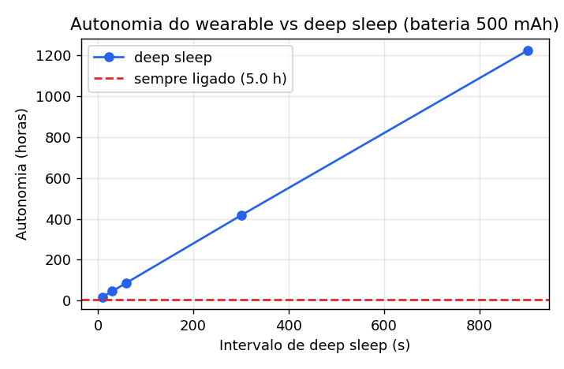
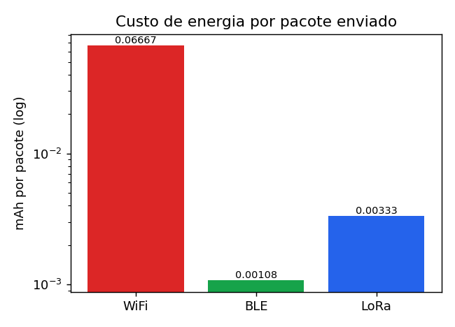

# 🔋 Otimização de energia — Frente 4

Análise de consumo do wearable ESP32. O **Wokwi não mede potência**, então os
números abaixo são estimativas baseadas em datasheet (ESP32 / Espressif; SX1276 /
Semtech) e em um modelo de duty cycle. Reproduzível via
[`energy_model.py`](energy_model.py) (gera as duas figuras).

## Premissas
| Parâmetro | Valor | Fonte |
|-----------|-------|-------|
| Corrente acordado (ESP32 + WiFi) | ~120 mA (média) | datasheet ESP32 |
| Corrente em **deep sleep** (RTC timer) | ~10 µA | datasheet ESP32 |
| Tempo acordado por envio | ~3 s (associar WiFi + POST) | medição típica |
| Bateria | 500 mAh (LiPo de wearable) | premissa de projeto |

## Por que deep sleep

O firmware ([`../firmware/firmware.ino`](../firmware/firmware.ino)) faz
**acordar → ler sensores → POST → `esp_deep_sleep_start()`**. Como o ESP32
reinicia em `setup()` ao acordar, a bateria e o contador de ciclos ficam em
**memória RTC** (`RTC_DATA_ATTR`), que sobrevive ao sono. O modo é configurável
(`USE_DEEP_SLEEP`): ligado para produção (baixo consumo), desligado para uma
demonstração contínua mais fluida no Wokwi.

## Tabela 1 — Autonomia: sempre ligado vs deep sleep
Corrente média `I_avg = (I_ativo·t_ativo + I_sleep·t_sleep) / período`;
autonomia `= 500 mAh / I_avg`.

| Modo | I_média | Autonomia | Ganho vs sempre ligado |
|------|--------:|----------:|-----------------------:|
| Sempre ligado (WiFi) | 100 mA | **5,0 h** | 1× |
| Deep sleep 10 s | 27,7 mA | 18,1 h | 3,6× |
| Deep sleep 30 s | 10,9 mA | 45,8 h | 9× |
| Deep sleep 60 s | 5,7 mA | **3,6 dias** | 17× |
| Deep sleep 300 s | 1,2 mA | 17,4 dias | 83× |
| Deep sleep 900 s | 0,41 mA | **51 dias** | 245× |

> Conclusão: dormir 60 s entre leituras já leva de **5 h para ~3,6 dias** de
> autonomia — o deep sleep é a única mudança que viabiliza um wearable de missão.

## Tabela 2 — Comparação de rádios (energia por pacote)
`energia = I_TX × tempo_de_envio`. O que importa não é só a corrente de pico, e
sim a **energia por pacote** (corrente × tempo no ar).

| Tecnologia | I_TX | Tempo/pacote | mAh/pacote | Alcance | Taxa | Melhor para |
|------------|-----:|-------------:|-----------:|---------|------|-------------|
| **WiFi** | ~120 mA | ~2 s | 0,0667 | ~50 m | Mbps | infra existente, payload grande (POC) |
| **BLE** | ~130 mA | ~30 ms | 0,0011 | ~10–30 m | ~1 Mbps | wearable em cabine (curto alcance) |
| **LoRa** | ~40 mA | ~300 ms | 0,0033 | km | 0,3–50 kbps | EVA / telemetria esparsa a longa distância |

> BLE gasta **~62× menos energia por pacote** que WiFi; LoRa **~20× menos** e
> alcança quilômetros (ao custo de taxa baixa).

## Recomendação para a arquitetura
- **POC atual:** WiFi — simples, já integrado ao backend, bom para o vídeo.
- **Produção em cabine:** BLE do wearable → gateway na nave (menor energia/pacote).
- **EVA / longa distância:** LoRa (alcance em km, duty cycle baixíssimo).
- **Sempre:** deep sleep entre leituras — o maior fator isolado de autonomia.

## Referências
- ESP32 Series Datasheet (Espressif) — correntes de RF active / deep sleep.
- Semtech SX1276 Datasheet — corrente de TX e airtime LoRa.
- Bluetooth Core Spec — consumo de eventos BLE.
